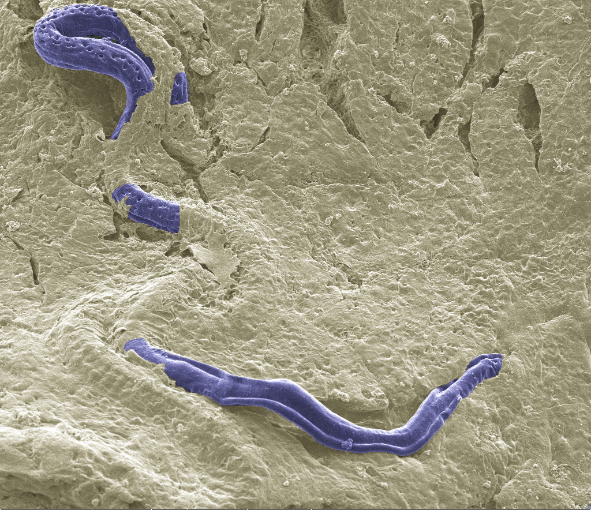
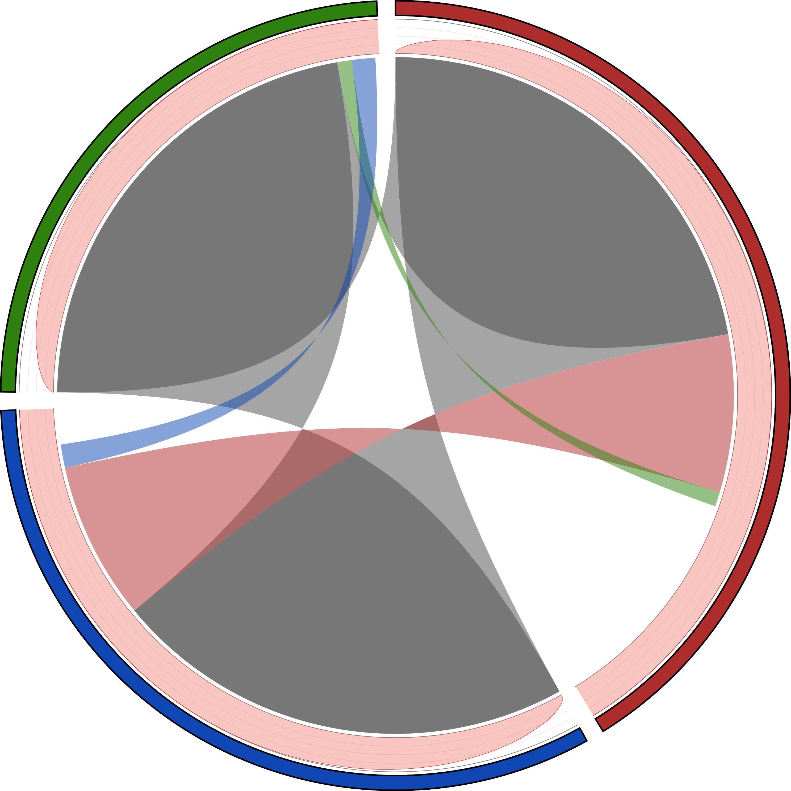
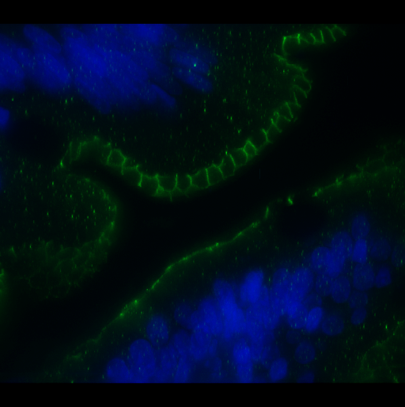

 

  <ol class="carousel-indicators">
    <li data-target="#carouselExampleIndicators" data-slide-to="0" class="active"></li>
    <li data-target="#carouselExampleIndicators" data-slide-to="1"></li>
    <li data-target="#carouselExampleIndicators" data-slide-to="2"></li>
    <li data-target="#carouselExampleIndicators" data-slide-to="3"></li>
  </ol>
  

        

            
        

        

            
        

        

            
       

        

            
    

  

  <a class="carousel-control-prev" href="#carouselExampleIndicators" role="button" data-slide="prev">
    
    Previous
  </a>
  <a class="carousel-control-next" href="#carouselExampleIndicators" role="button" data-slide="next">
    
    Next
  </a>

 

<row> 

 
<h3 style="text-align: center; font-style: oblique;">Dr Christopher Gaulke's research focuses on understanding the mechanisms through which the gut microbiome mediates the impacts of environmental exposures on host physiology</h3>

  

    

      
      <h4 class="card-title" style="text-align: center;">Host-Microbe Interactions</h4>
      
 Understanding the mechanisms that underpin associations between the microbiome and health.

    

   
    

      <a href="#" style="color: white;"><h4>Read More</h4></a>
    

 
  

  
 

    

      
      <h4 class="card-title" style="text-align: center;">Microbial Exposure Science</h4>
      
 Elucidating how environmental exposures impact host-microbiome interactions.

    

   
    

        <a href="#" style="color: white;"><h4>Read More</h4></a>
    

 
  

  

   

      
      <h4 class="card-title" style="text-align: center;">Nutritional Microbiology</h4>
      
 Quantifying the effects of dietary variation on microbiome operation.

    

    
    

        <a href="#" style="color: white;"><h4>Read More</h4></a>
    

  

</row> 
